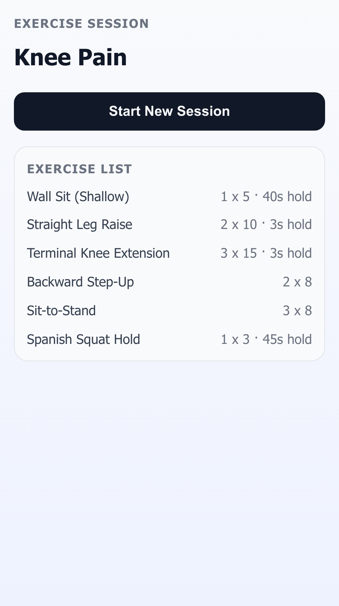
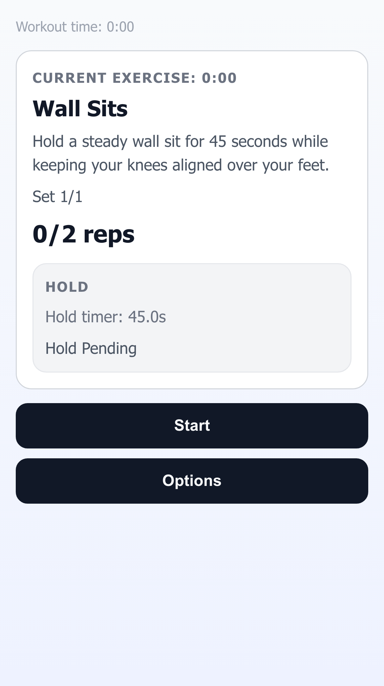
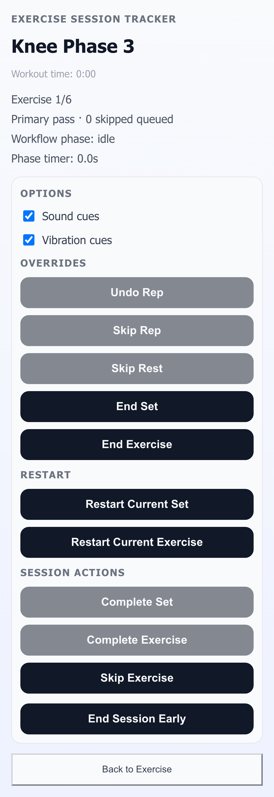

# Exercise Session Tracker

Mobile-first React app for running an exercise session from a JSON prescription.

[](https://github.com/jamiely/exercise/actions/workflows/ci.yml)
[](https://github.com/jamiely/exercise/actions/workflows/deploy-pages.yml)

## Stack

- `pnpm`
- `Vite` + React + TypeScript
- `Vitest` + Testing Library
- `Playwright` (mobile profile)

## Features

- Loads prescription data from `src/data/program.json`.
- Enforces ordered primary pass through exercises.
- Supports skipping exercises and automatic skipped-cycle revisit.
- Tracks reps per set (`x/target reps`) and supports undo.
- Supports hold-based exercises where a completed hold counts as one rep.
- Includes runtime hold/rest phase timers with pause/resume consistency.
- Supports rest controls (`+`) and swipe-to-dismiss for active rest phases.
- Supports `Restart Current Set` and `Restart Current Exercise` from session options.
- Persists in-progress session state in `localStorage`.
- Prompts `Resume` vs `Start New` on reload when an active session exists.
- Supports de-emphasized `End Session Early` with terminal summary.

## Screenshots

### Session Start



### Active Exercise



### Session Options



## Accessibility and Hardening Notes

- Buttons use visible `:focus-visible` outlines for keyboard navigation.
- Hold timer toggle exposes `aria-pressed` state (`Start Hold` / `Pause Hold`).
- Touch targets use a minimum control height for mobile usability.
- Persistence uses a versioned envelope and safely discards invalid/corrupt payloads.

## Getting Started

1. Install dependencies:

```bash
corepack pnpm install
```

2. Start dev server:

```bash
corepack pnpm dev
```

## Scripts

- `corepack pnpm prettier --check .` (when Prettier is added/configured)
- `corepack pnpm prettier --write .` (when Prettier is added/configured)
- `corepack pnpm lint`
- `corepack pnpm test`
- `corepack pnpm test:coverage`
- `corepack pnpm build`
- `corepack pnpm test:e2e`
- `corepack pnpm screenshots:readme`

## Final Verification Pipeline

Run the full regression check:

```bash
mkdir -p test-results && corepack pnpm prettier --check . && corepack pnpm lint && corepack pnpm test && corepack pnpm build && corepack pnpm test:e2e
```

## GitHub Pages Deployment

This repo includes `.github/workflows/deploy-pages.yml` to deploy `dist/` to GitHub Pages on every push to `main` (or via manual workflow dispatch).

One-time repo setup in GitHub:

1. Open repo `Settings` -> `Pages`.
2. Set `Source` to `GitHub Actions`.
3. Ensure default branch is `main`.

After your next push to `main`, the site will publish at:

- `https://jamiely.github.io/exercise/`

## Known Limitations

- The app assumes a single active local session in browser `localStorage` (no multi-user/session switching UI).
- No remote sync or account-backed persistence.
- Timer progression is client-driven; background tab throttling can affect perceived real-time cadence.
