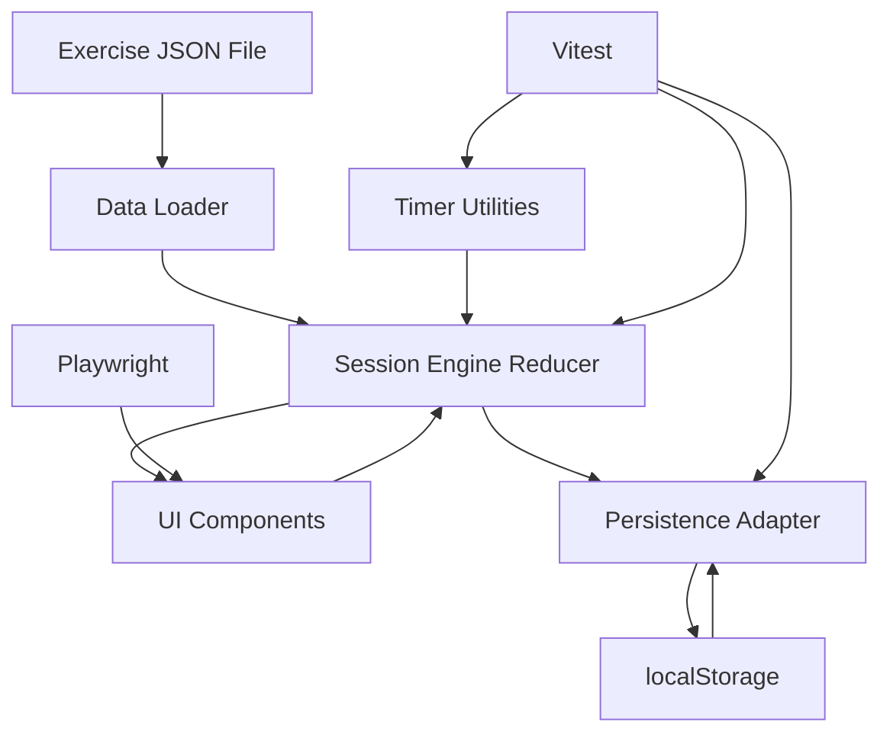
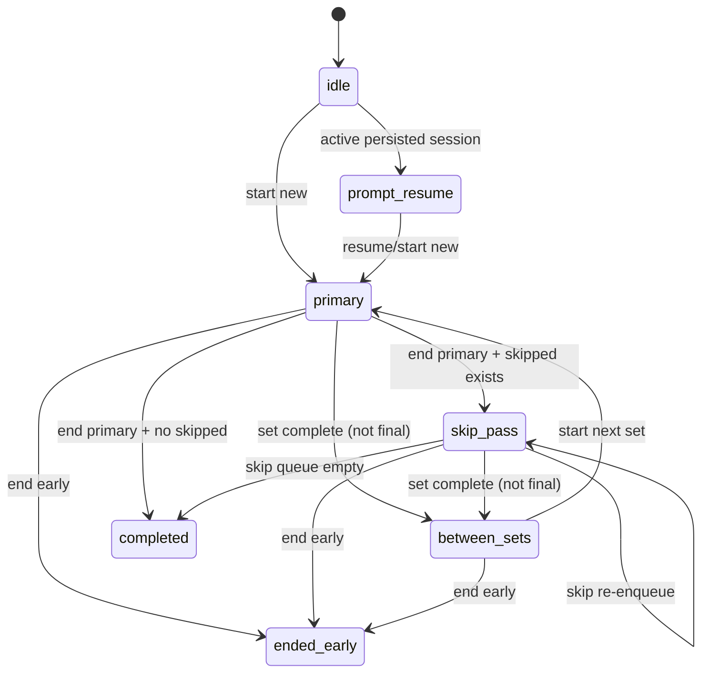
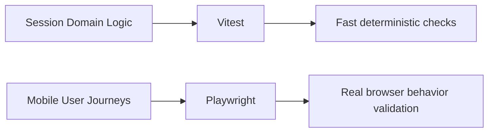

# Exercise Tracker Design

## Overview

This design defines a mobile-optimized React web app for tracking a knee-exercise session. The app loads a prescribed exercise list from JSON, guides the user in order, allows skipping and automatic revisit of skipped items, tracks reps/sets/hold timing/rest timing in-session, persists progress in local storage, and supports both Vitest and Playwright test coverage.

Core goals:

- Fast in-session logging on mobile
- Deterministic exercise progression
- Reliable resume/new behavior after app reopen
- Clear completion vs early-end outcomes

## Detailed Requirements

- Platform and tooling:
  - React app
  - Vite build/dev setup
  - pnpm package manager
  - Vitest for unit/integration tests
  - Playwright for end-to-end confirmation
- Data source:
  - Exercises are loaded from a JSON file
  - Exercise list corresponds to the knee pain program (including ordering and prescription fields)
- Session progression:
  - Primary pass follows JSON order
  - User can skip current exercise
  - Skipped exercises are revisited automatically after primary pass
  - Cycle continues until all exercises are complete unless user ends early
- Tracking behavior:
  - Show target prescription per exercise (sets/reps/hold)
  - Reps displayed as fraction (e.g., `0/12 reps`)
  - User taps to increment completed reps
  - Hold-based completion counts as rep completion
  - Sets are shown and marked completed
  - Between sets, rest timer increments
- Session lifecycle:
  - In-progress session persists in local storage
  - On reopen with active session, prompt user: resume or start new
  - Include a way to end session early, but de-emphasized relative to primary actions
- UX constraints:
  - Mobile-first layout
  - Primary controls are easy to reach/tap

## Architecture Overview

The app is a client-only SPA with local JSON and localStorage persistence.

Layers:

- `data layer`: static exercise JSON loader + schema validation
- `domain layer`: session state machine/reducer and timer logic
- `persistence layer`: localStorage read/write/version handling
- `ui layer`: mobile-focused views and controls
- `test layer`: Vitest (domain/persistence/unit UI) + Playwright (end-to-end flow)

### Mermaid: Architecture

## Components and Interfaces

- `AppShell`
  - Bootstraps app, loads exercise program, checks persisted session, controls resume prompt.
- `ResumePrompt`
  - Shows when in-progress session exists.
  - Actions: `Resume Session`, `Start New Session`.
- `SessionScreen`
  - Primary active-exercise view.
  - Displays progression (`Exercise i/n`, phase, skipped count).
- `ExerciseCard`
  - Shows name, target sets/reps/hold, notes/availability info.
- `SetTracker`
  - Shows set list and active set status.
- `RepControls`
  - `+1 Rep` (primary), optional `Undo Rep` (secondary).
- `HoldTimer`
  - Shows elapsed vs target hold; successful hold increments rep.
- `RestTimer`
  - Increments while between sets; controls transition to next set.
- `SessionActions`
  - `Complete Exercise`, `Skip Exercise`, de-emphasized `End Session Early`.
- `SessionSummary`
  - End state summary for completed or ended early sessions.

### Interface Contracts (Conceptual)

- `loadProgram(): Program`
- `createNewSession(program): SessionState`
- `resumeSession(saved): SessionState`
- `reduceSession(state, action): SessionState`
- `persistSession(state): void`
- `readPersistedSession(): SessionState | null`
- `clearPersistedSession(): void`

## Data Models

### Program JSON Model

- `version: number`
- `programName: string`
- `exercises: Exercise[]`

`Exercise`:

- `id: string` (stable unique)
- `name: string`
- `order: number` (unique, determines progression)
- `targetSets: number`
- `targetRepsPerSet: number`
- `holdSeconds: number | null`
- `optional: boolean`
- `notes: string | null`
- `availableOnOrAfter: string | null` (ISO date)

### Runtime Session Model

- `sessionId: string`
- `status: 'in_progress' | 'completed' | 'ended_early'`
- `startedAt: string`
- `updatedAt: string`
- `endedAt: string | null`
- `endedEarly: boolean`
- `currentPhase: 'primary' | 'skip'`
- `primaryCursor: number`
- `currentExerciseId: string`
- `skipQueue: string[]`
- `exerciseProgress: Record<string, ExerciseProgress>`

`ExerciseProgress`:

- `completed: boolean`
- `skippedCount: number`
- `activeSetIndex: number`
- `sets: { setNumber: number; completedReps: number; targetReps: number }[]`
- `holdTimerRunning: boolean`
- `holdElapsedSeconds: number`
- `restTimerRunning: boolean`
- `restElapsedSeconds: number`

### Mermaid: Session Flow

## Error Handling

- Program load/validation errors:
  - Show blocking error state with concise message (`Invalid exercise data`)
  - Do not start session until valid data exists
- localStorage read errors (corrupt JSON):
  - Ignore bad value, clear persisted entry, continue to new-session start
- localStorage write errors (quota/unavailable):
  - Non-blocking warning banner (`Progress may not persist`)
  - Keep session functioning in memory
- Timer drift/background behavior:
  - Recalculate elapsed from timestamps where possible when app resumes
- Date-gated exercises:
  - If `availableOnOrAfter` is in the future, show disabled/locked indicator and exclude from active pass until available

## Acceptance Criteria (Given-When-Then)

1. Ordered progression

- Given a valid exercise JSON list with order values
- When the user starts a new session
- Then the first active exercise is the smallest order item and progression follows order.

2. Skip and revisit

- Given the user skips one or more exercises in primary pass
- When the user reaches the end of the primary list
- Then the app automatically transitions to skipped exercises and cycles until skipped queue is empty.

3. Rep/set tracking

- Given an exercise with target reps per set
- When the user taps `+1 Rep`
- Then completed reps increase and display as `x/target` for the active set.

4. Hold counts as rep

- Given an exercise with `holdSeconds`
- When the hold timer reaches target and user completes hold
- Then rep count increments by 1 for the active set.

5. Between-set rest timer

- Given a set reaches its target reps and additional sets remain
- When set is marked complete
- Then rest timer is shown and increments until user starts next set.

6. Resume/new prompt

- Given a persisted in-progress session exists
- When app loads
- Then user is prompted to resume or start new before entering session screen.

7. Early end (de-emphasized)

- Given an active session
- When user chooses end-early action
- Then session status becomes `ended_early` and summary is displayed.

8. JSON-driven exercise data

- Given exercise JSON is updated with changed prescription values
- When app starts a new session
- Then the UI targets reflect the updated JSON values.

9. Completed session

- Given all required exercises are completed and skip queue is empty
- When final exercise is completed
- Then session status becomes `completed` and completion summary is shown.

10. Persistence reliability

- Given progress is made in-session
- When app reloads and user chooses `Resume`
- Then prior exercise/set/rep progression is restored from localStorage.

## Testing Strategy

### Vitest

- Session reducer transition tests (primary/skip/completion/early-end)
- Rep/set accounting tests
- Hold timer and rest timer utility tests (mocked clock)
- Persistence adapter tests (read/write/corrupt data fallback)
- Component tests for key rendering and action wiring

### Playwright

- Mobile viewport E2E baseline
- Start session -> progress ordered exercises
- Skip during primary -> auto revisit skipped at end
- Hold exercise flow -> hold completion increments rep
- Between-set rest timer visibility and increment behavior
- End early flow
- Resume prompt flow after reload with active session

### Mermaid: Test Layering

## Appendices

### Technology Choices

- React + Vite: fast dev workflow and straightforward SPA structure
- pnpm: required package manager, efficient dependency handling
- Vitest: fast unit/integration tests in Vite ecosystem
- Playwright: robust E2E validation, mobile viewport coverage
- localStorage: sufficient persistence for single-device personal tracker use case

### Research Findings Summary

- Session model should be explicit state machine to avoid ambiguous skip loops.
- Program JSON and runtime session state should remain separate.
- Mobile UX should keep active exercise + controls on one screen.
- Split testing responsibilities: Vitest for domain correctness, Playwright for full-flow confidence.

### Alternative Approaches Considered

- IndexedDB instead of localStorage:
  - Better for scale, but unnecessary complexity for current scope.
- Free exercise navigation instead of ordered flow:
  - Rejected due to requirement for ordered prescription with controlled skipping.
- Server-backed persistence:
  - Rejected; local-only requirement and faster implementation path.
