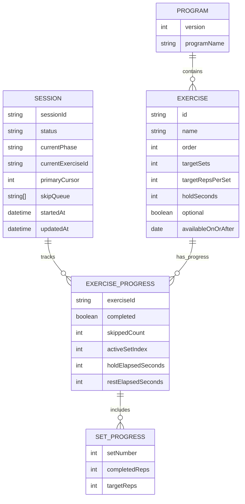

# Data Schema Research

## Objective

Define JSON exercise schema and localStorage persistence schema for robust session tracking.

## Key Findings

- Exercise prescriptions should be immutable source data loaded from JSON.
- Session progress should be separate mutable runtime data in localStorage.
- Schema should support rep-based and hold-based exercises in one model.
- Hold completion should count as rep completion.

## Proposed Exercise JSON Schema

```json
{
  "version": 1,
  "programName": "Knee pain",
  "exercises": [
    {
      "id": "wall-sits-shallow",
      "name": "Wall sits (shallow)",
      "order": 1,
      "targetSets": 1,
      "targetRepsPerSet": 5,
      "holdSeconds": 40,
      "restHintSeconds": null,
      "notes": "Twice a day",
      "optional": false,
      "availableOnOrAfter": null
    }
  ]
}
```

## Proposed Session Persistence Schema (localStorage)

```json
{
  "sessionId": "2026-02-10T20:45:00.000Z",
  "status": "in_progress",
  "startedAt": "2026-02-10T20:45:00.000Z",
  "updatedAt": "2026-02-10T20:58:10.000Z",
  "endedAt": null,
  "endedEarly": false,
  "currentPhase": "primary",
  "currentExerciseId": "wall-sits-shallow",
  "primaryCursor": 0,
  "skipQueue": ["sit-to-stands"],
  "exerciseProgress": {
    "wall-sits-shallow": {
      "completed": false,
      "skippedCount": 0,
      "sets": [{ "setNumber": 1, "completedReps": 3, "targetReps": 5 }],
      "activeSetIndex": 0,
      "holdTimerRunning": false,
      "holdElapsedSeconds": 0,
      "restTimerRunning": false,
      "restElapsedSeconds": 0,
      "lastUpdatedAt": "2026-02-10T20:58:10.000Z"
    }
  }
}
```

## Data Validation Rules

- `targetSets` >= 1
- `targetRepsPerSet` >= 1
- `holdSeconds` is null or > 0
- `order` unique and contiguous
- `id` unique and stable
- `availableOnOrAfter` null or ISO date

## Mermaid: Data Relationship



## Sources

- Local requirement record: `specs/exercise-tracker/requirements.md`
- Source exercise plan extracted from: `/Users/jamiely/Downloads/Knee pain.epub`
