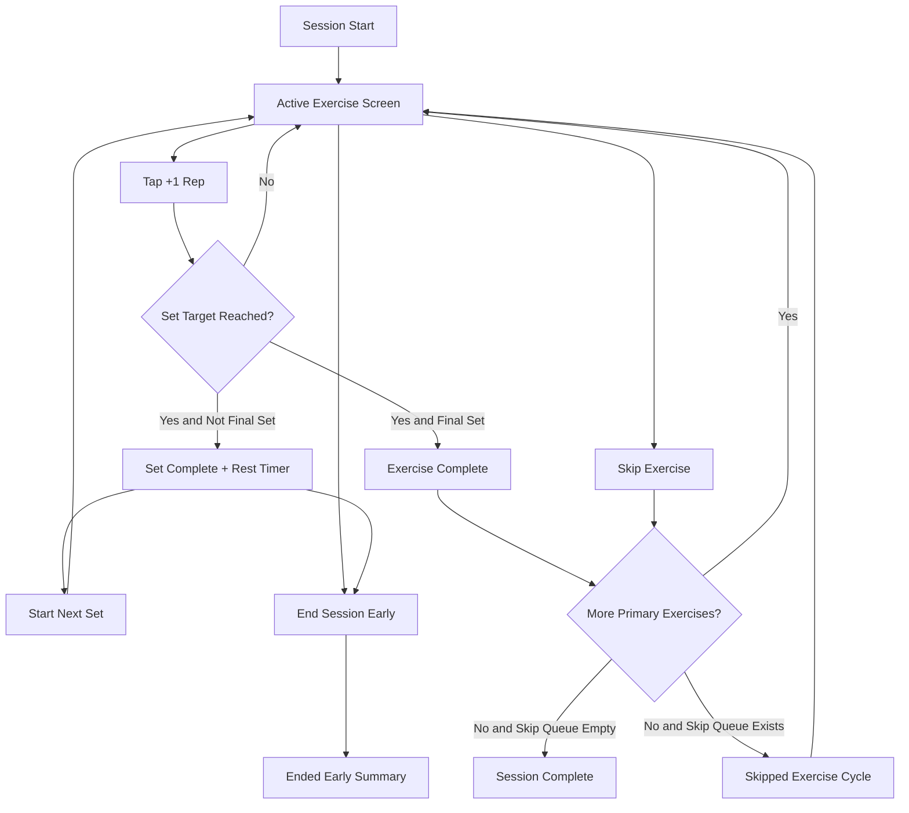

# Mobile UX Flow Research

## Objective

Define a mobile-first session UI optimized for quick in-session logging with minimal friction.

## Key Findings

- Single-screen "active exercise" focus reduces cognitive load.
- Large tap targets are required for rep increments and set completion.
- Timers should be persistent and visible without navigation.
- Early-end action should be accessible but visually secondary (text button in overflow/footnote area).

## Proposed Screen Structure

- Header: session status (`Exercise 2/8`, phase, skipped count)
- Main card:
  - exercise name
  - target prescription summary
  - optional availability/date note
- Set tracker:
  - chips or stacked cards for each set (`Set 1: 0/12`)
  - active set highlighted
- Rep controls:
  - primary `+1 Rep` button
  - secondary `Undo Rep` button
- Hold timer (if applicable):
  - `Start Hold`/`Stop Hold`
  - elapsed + target display
- Rest timer (between sets):
  - auto-increment display
  - `Start Next Set` primary action
- Navigation row:
  - primary: `Complete Exercise` (enabled when targets met)
  - secondary: `Skip Exercise`
  - tertiary/de-emphasized: `End Session Early`

## Interaction Behavior

- Rep display format: `{completed}/{target} reps`
- Completing target reps for a set marks set complete and enters rest mode (except final set)
- For hold exercises, each successful hold completion increments rep count by 1
- On skip, user moves immediately to next item and exercise is queued for later

## Accessibility and Mobile Constraints

- Minimum touch target: 44x44 px
- Preserve visible controls above fold on ~390x844 viewport
- High contrast for active set and timer status
- Avoid hidden gestures for core actions

## Mermaid: Screen Flow

## Sources

- Local requirement record: `specs/exercise-tracker/requirements.md`
- Source exercise plan extracted from: `/Users/jamiely/Downloads/Knee pain.epub`
