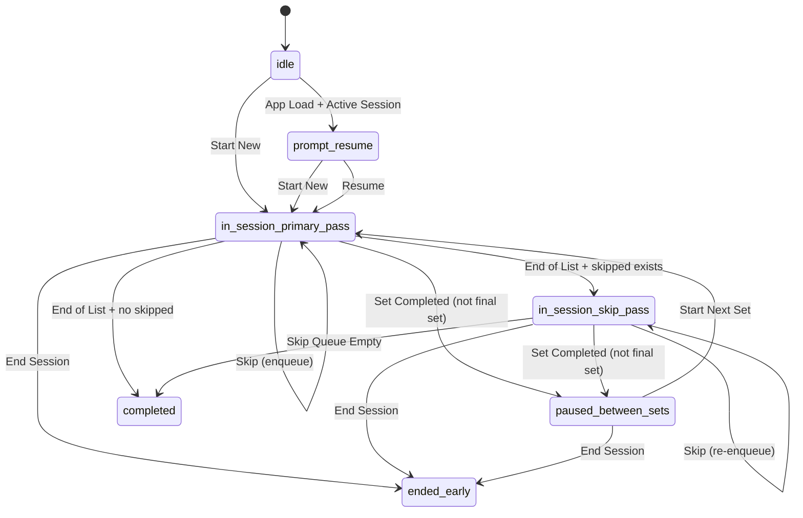

# Session State Model Research

## Objective
Define a deterministic session lifecycle for ordered progression, skip/revisit behavior, early-end behavior, and resume decisions.

## Key Findings
- Exercise order should follow the JSON list strictly during the first pass.
- `Skip` should defer an exercise into a skip queue, not mark it complete.
- After first pass ends, session should automatically cycle through skipped exercises in queue order until complete or user ends early.
- Early end should be available but visually de-emphasized.
- On app reopen with an in-progress session, user should be prompted to either resume or start a new session.

## Recommended Session States
- `idle`: No active in-progress session selected.
- `prompt_resume`: In-progress session exists; user chooses resume/new.
- `in_session_primary_pass`: Traversing exercises in JSON order.
- `in_session_skip_pass`: Traversing skipped exercises queue.
- `paused_between_sets`: Rest timer running between sets.
- `completed`: All exercises complete.
- `ended_early`: User intentionally ends before completion.

## Transition Rules
- `Start New` from `idle` -> `in_session_primary_pass`
- App load with active session -> `prompt_resume`
- `Resume` from `prompt_resume` -> prior in-session state
- `Start New` from `prompt_resume` -> `in_session_primary_pass` (after replacing prior session)
- `Skip Exercise` in primary pass -> enqueue exercise -> move to next exercise
- End primary pass with non-empty skip queue -> `in_session_skip_pass`
- End primary pass with empty skip queue -> `completed`
- In skip pass, completing exercise removes it from queue
- In skip pass, skipping again re-enqueues to tail
- Empty skip queue in skip pass -> `completed`
- `End Session` from any in-session state -> `ended_early`

## Mermaid: State Machine

## Risks and Mitigations
- Risk: Re-skipping can create perceived loop.  
  Mitigation: show skip queue count and labels (e.g., "Skipped remaining: 2").
- Risk: ambiguous restore point after app close.  
  Mitigation: persist exact current exercise id, set index, rep count, timer state snapshot.

## Sources
- Local requirement record: `specs/exercise-tracker/requirements.md`
- Source exercise plan extracted from: `/Users/jamiely/Downloads/Knee pain.epub`
