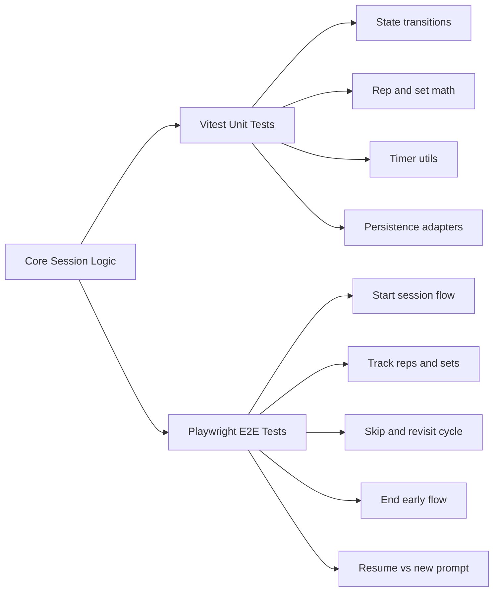

# Testing Strategy Research (Vitest + Playwright)

## Objective

Define a layered strategy using unit/integration tests (Vitest) and end-to-end tests (Playwright) to confirm functional correctness.

## Key Findings

- State transitions and timer logic are best validated in fast deterministic Vitest tests.
- Critical user flows (resume prompt, progression, skip cycle, early end) should be confirmed with Playwright.
- Time-dependent behavior requires mocked clocks in Vitest and controlled waits/assertions in Playwright.

## Vitest Scope

- Reducer/state machine transitions:
  - primary pass progression
  - skip enqueue/dequeue/re-enqueue behavior
  - completion and ended-early transitions
- Rep/set accounting:
  - rep increment/decrement
  - set completion threshold
  - hold completion increments rep
- Persistence adapters:
  - serialize/deserialize session shape
  - recover with version mismatch fallback
- Timer utilities:
  - rest timer increments
  - hold timer completion criteria

## Playwright Scope

- Session bootstrap:
  - load exercises from JSON
  - start session on mobile viewport
- In-session tracking:
  - tap reps until set completes
  - verify set marker and rest timer behavior
  - progress to next exercise
- Skip cycle:
  - skip one/more exercises in primary pass
  - verify skipped exercises return automatically after list end
- Early end:
  - trigger de-emphasized end action
  - verify ended-early summary state
- Resume prompt:
  - create partial session
  - reload app
  - assert prompt offers resume vs start new

## Recommended Playwright Configuration Notes

- Use mobile emulation (e.g., iPhone 13 viewport dimensions) for primary E2E coverage
- Use isolated storage state per test
- Seed deterministic JSON fixture data for predictable assertions

## Mermaid: Test Coverage Map

## Sources

- Local requirement record: `specs/exercise-tracker/requirements.md`
- Playwright docs: https://playwright.dev/
- Vitest docs: https://vitest.dev/
