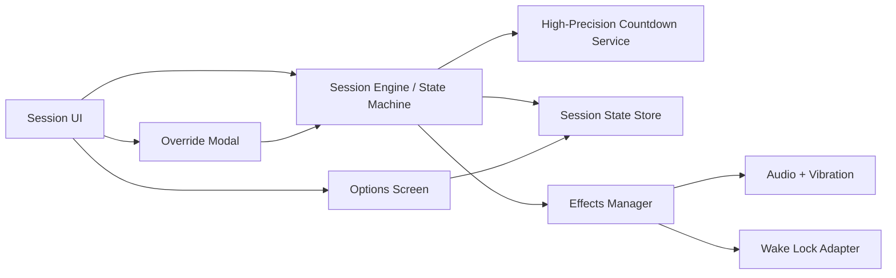
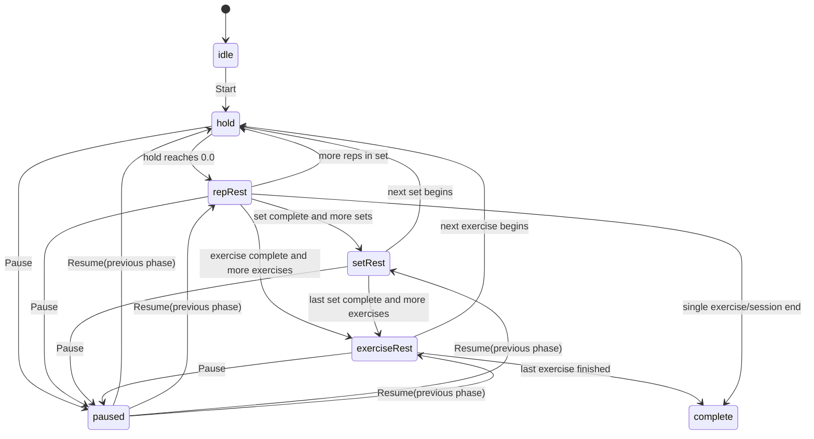
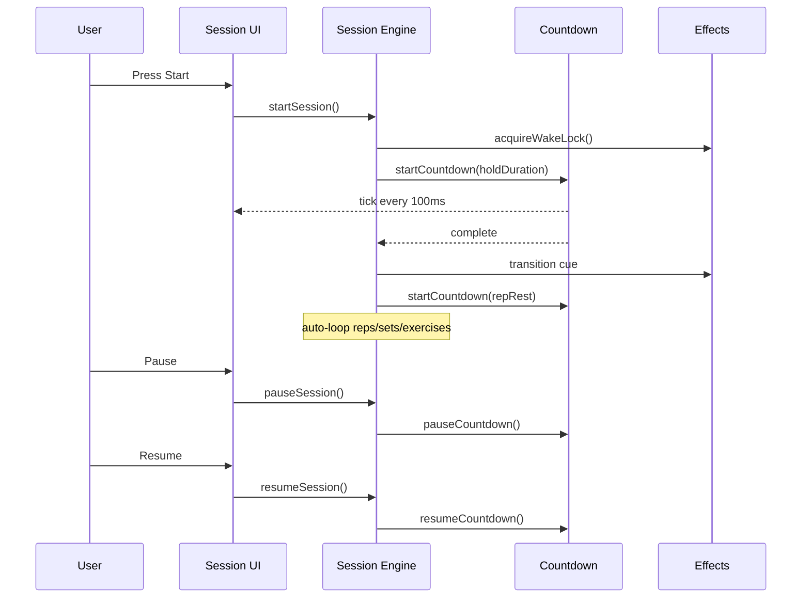

# Hands-Free Hold Workflow Design

## Overview

This design adds a mostly hands-free execution flow for hold-based exercises. A single `Start` action begins automated progression across reps, sets, and exercises with configurable rest intervals, while preserving minimal manual override controls.

Primary outcomes:

- Reduce required taps during a workout session.
- Keep timing predictable with clear countdowns in tenths of seconds.
- Support interruption controls (`Pause`/`Resume` and override menu) without breaking the automatic flow model.

## Detailed Requirements

1. Hold reps use a countdown from a configured hold target duration.
2. When hold countdown reaches `0.0`, transition automatically to rep rest.
3. `Pause` freezes current timer state exactly; `Resume` continues from that remaining value.
4. Rep rest and set rest are independently configurable per exercise, both defaulting to `30s`.
5. `Start` initiates automated progression for the whole exercise flow, not only a single rep.
6. On set completion, auto-advance to the next set with set rest countdown in between.
7. On exercise completion, auto-advance to next exercise with configurable exercise rest in between.
8. Show tenths of seconds for all active countdown timers (hold, rep rest, set rest, exercise rest).
9. Remove explicit `target:` and `active set:` text labels from session UI.
10. Provide an options screen with sound/vibration toggles, default enabled.
11. If app is backgrounded or device is locked, timers suspend rather than continue in background.
12. Attempt to keep screen awake during active sessions using Wake Lock where available; fail silently when unsupported.
13. Provide quick override actions in a modal menu opened by a small unobtrusive bottom button.

## Architecture Overview

The session runtime is modeled as a deterministic state machine. Timer rendering and transition side effects (audio/vibration/wake lock) are driven by state transitions, not ad hoc UI events.



## Components and Interfaces

1. Session Engine

- Responsibility: orchestrate phases and auto-advancement.
- Interface:
  - `startSession(sessionPlan)`
  - `pauseSession()`
  - `resumeSession()`
  - `applyOverride(action)` where action in `skipRep | skipRest | endSet | endExercise`
  - `handleLifecycle(event)` where event in `background | foreground | lock | unlock`

2. Countdown Service

- Responsibility: countdown in tenths precision and callback on completion.
- Interface:
  - `startCountdown(msTotal, tickMs = 100)`
  - `pauseCountdown()`
  - `resumeCountdown()`
  - `cancelCountdown()`

3. Session Store

- Responsibility: persist in-memory runtime state for rendering and resume.
- Key state:
  - `phase`: `idle | hold | repRest | setRest | exerciseRest | paused | complete`
  - `remainingMs`
  - `exerciseIndex`, `setIndex`, `repIndex`
  - per-exercise config: `holdDurationMs`, `repRestMs`, `setRestMs`, `exerciseRestMs`
  - options: `soundEnabled=true`, `vibrationEnabled=true`

4. Effects Manager

- Responsibility: trigger optional cues and wake lock behavior.
- Interface:
  - `onPhaseEntered(phase)`
  - `onCountdownThreshold(remainingMs)` for 3-2-1 cues
  - `acquireWakeLock()` / `releaseWakeLock()`

5. Session UI

- Responsibility: display primary countdown, phase indicator, progress indicators, start/pause/resume controls, and override launcher button.
- Constraints:
  - Do not display textual `target:` or `active set:` labels.
  - Keep override button unobtrusive at bottom; opens modal menu.

6. Options Screen

- Responsibility: expose sound/vibration toggles (default ON).

## Data Models

```ts
interface ExerciseConfig {
  id: string
  name: string
  holdDurationMs: number
  repCount: number
  setCount: number
  repRestMs: number // default 30000
  setRestMs: number // default 30000
  exerciseRestMs: number // default 30000
}

interface SessionRuntimeState {
  phase: 'idle' | 'hold' | 'repRest' | 'setRest' | 'exerciseRest' | 'paused' | 'complete'
  exerciseIndex: number
  setIndex: number
  repIndex: number
  remainingMs: number
  previousPhase?: 'hold' | 'repRest' | 'setRest' | 'exerciseRest'
  pausedAtMs?: number
}

interface UserOptions {
  soundEnabled: boolean // default true
  vibrationEnabled: boolean // default true
}
```

State transition model:



Timer/event flow:



## Error Handling

1. Wake lock unavailable or denied

- Behavior: continue session without wake lock.
- User messaging: none required by requirement.

2. App background/lock lifecycle event

- Behavior: suspend active countdown immediately and enter paused state.
- Resume requires user action once app returns.

3. Invalid per-exercise timing config

- Behavior: reject save in configuration UI with validation (minimum > 0).
- Fallback defaults: rep/set/exercise rest `30000ms` only for missing values.

4. Timer drift or delayed ticks

- Behavior: compute remaining time from monotonic timestamps rather than tick count accumulation.

## Acceptance Criteria

1. Given a hold exercise with target 20s, when user presses `Start`, then the timer counts down from `20.0` to `0.0` in tenths.
2. Given hold timer reaches `0.0`, when completion event fires, then rep rest starts automatically without tap.
3. Given rep rest and set rest are not explicitly set, when exercise config is created, then both defaults are `30s` and remain independently editable.
4. Given a set's final rep finishes and rep rest completes, when transition is evaluated, then the app enters set rest and then starts next set automatically.
5. Given an exercise's final set finishes, when transition is evaluated, then app enters exercise rest and then starts next exercise automatically.
6. Given user taps `Pause` during any active countdown, when paused, then remaining time is preserved exactly and does not decrement.
7. Given user taps `Resume` after pause, when resumed, then countdown continues from exact preserved remaining time.
8. Given session UI is rendered, when active session is visible, then no `target:` or `active set:` textual labels are shown.
9. Given options defaults, when first opening options screen, then sound and vibration toggles are both ON.
10. Given app goes to background or device locks mid-timer, when lifecycle event is received, then timer suspends and does not progress until manual resume.
11. Given wake lock is supported and session starts, when active session runs, then app requests wake lock during active phases.
12. Given wake lock is unsupported, when session starts, then session still runs with no warning modal/toast.
13. Given user opens override menu from bottom button, when selecting any override action, then session transitions accordingly.

## Testing Strategy

1. Unit tests

- State-machine transition coverage for all phase boundaries.
- Pause/resume exact remaining-time preservation.
- Default value initialization and independent rest configuration.
- Lifecycle suspension behavior on background/lock events.

2. Integration tests

- End-to-end automated progression across reps -> sets -> exercises.
- Override menu actions and resulting transition correctness.
- Options toggles affecting cue emission behavior.

3. UI tests

- Timer displays tenths precision in all phases.
- `target:` and `active set:` labels are absent.
- Bottom override button visibility and modal interaction.

4. Non-functional tests

- Timer drift tolerance under moderate render load.
- Wake lock adapter no-crash behavior across supported/unsupported browsers.

## Appendices

### Technology Choices

- Deterministic state machine to avoid transition bugs from intertwined UI/event logic.
- 100ms timer tick with monotonic time reconciliation to reduce drift.
- Wake Lock API used opportunistically for active-session anti-lock behavior.

### Research Findings

- No separate research phase was run before this design.
- Design assumptions are based on captured requirements and current app constraints.

### Alternative Approaches

- Alternative: background-safe timers with notifications when locked.
- Rejected for this scope because requirement explicitly says timers suspend on background/lock.
