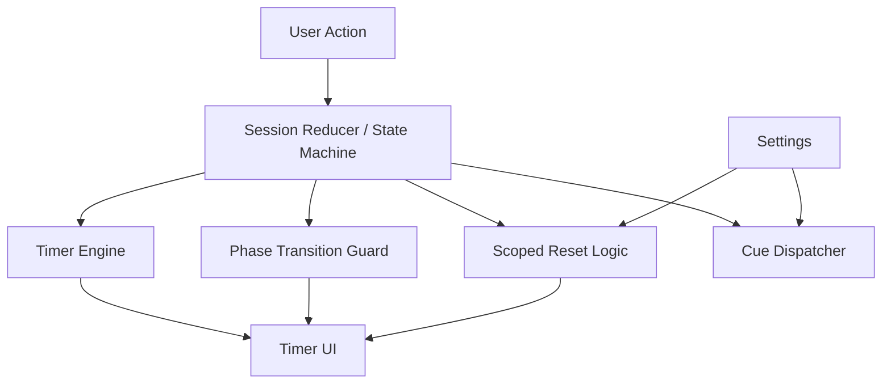
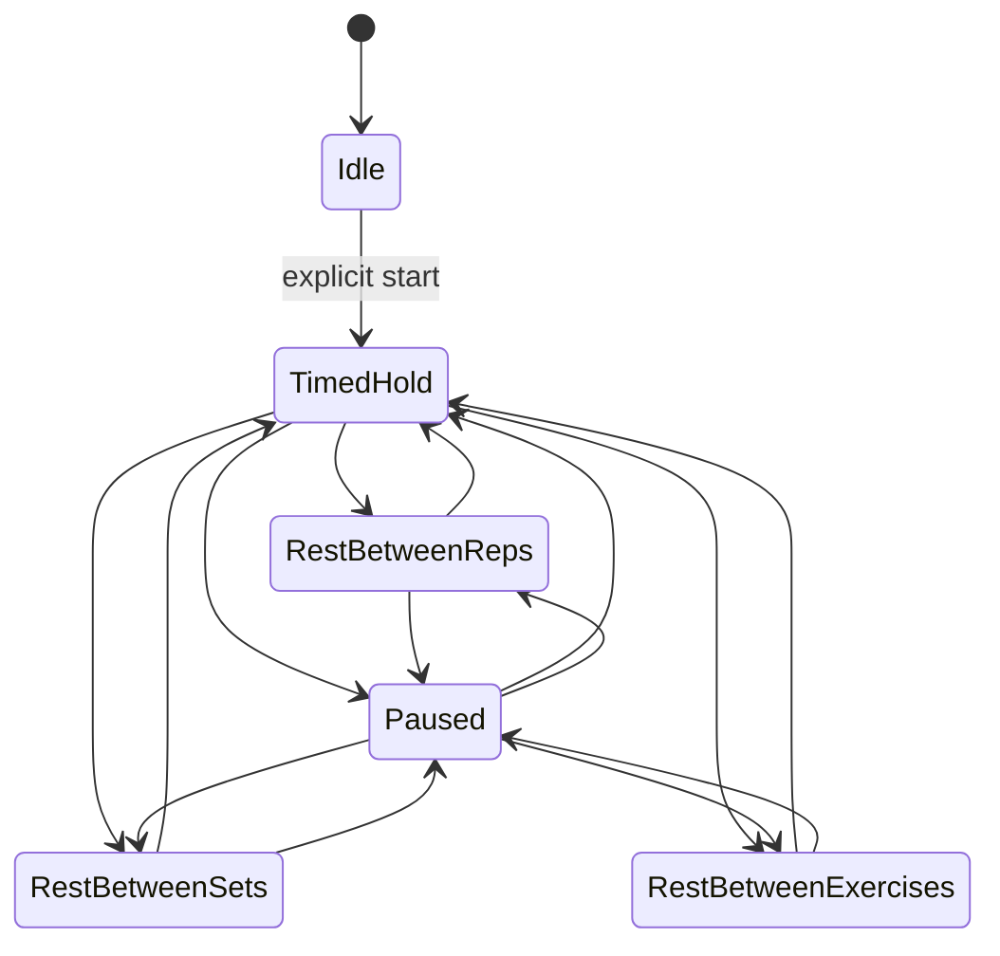

# Todo Execution Design

## Overview

This design operationalizes the backlog in `todo list.md` into a phased delivery approach focused on timer correctness, session-flow control, timer-visibility consistency, motion polish, and documentation accuracy.

The primary architecture remains existing session-domain + UI layers; changes concentrate on transition safety, control surface behavior, and testable UX invariants.

## Detailed Requirements

- Pause freezes all timer phases and resumes exactly.
- Rest increment control (`+`) functions reliably.
- Sound/vibration cues are correct and settings-aware.
- Timed exercise requires explicit start.
- Rest phases support swipe dismissal safely.
- Restart current exercise and restart current set are available and scoped.
- Between-set and between-exercise timed phases show clear countdowns.
- Any timed state must always render a visible timer.
- Exercise progression includes accessible swipe-style transition motion.
- README includes CI badges and current screenshots.

## Architecture Overview

Changes target three zones:

- Session state transitions: pause, resume, dismiss-rest, restart-scope actions.
- Timer presentation contract: timed phase implies timer UI visibility.
- Interaction layer: gesture + animation + settings actions.

## Components and Interfaces

1. Session transition API

- Extend actions/events for `pause`, `resume`, `dismissRest`, `restartSet`, `restartExercise`.

2. Timer control interfaces

- Keep `remainingMs` authoritative.
- Ensure paused states block decrement updates.

3. UI contracts

- Every timed phase maps to one visible countdown component.
- Rest control `+` updates source-of-truth duration and reflects immediately.

4. Cue integration

- Transition events emit cue intents.
- Settings gate actual sound/vibration dispatch.

## Data Models

No major schema rewrite required. Expected runtime additions or tightened invariants:

- `phase` enum includes all timed/non-timed states with explicit mapping.
- `remainingMs` is preserved through pause/resume.
- Scoped restart actions reset only intended indices/counters.

## Error Handling

- Ignore duplicate/invalid transition attempts when phase changed concurrently.
- On gesture-dismiss + timer-complete collision, apply only first valid transition.
- If cue API unavailable, fail silently without blocking workout progression.
- If animation fails or reduced-motion is enabled, fall back to non-animated transition.

## Acceptance Criteria (Given-When-Then)

1. Pause freeze

- Given an active timed phase
- When user pauses
- Then timer value does not change until resume.

2. Exact resume

- Given paused timer at `X`
- When user resumes
- Then countdown restarts from `X` in same phase.

3. Rest increment control

- Given rest timer controls are visible
- When user taps `+`
- Then displayed rest duration increases by configured step.

4. Explicit start

- Given user enters a timed exercise
- When no start action is taken
- Then countdown remains idle.

5. Swipe dismiss rest

- Given user is in active rest phase
- When user swipes to dismiss
- Then app transitions once to correct next phase.

6. Restart exercise scope

- Given progress exists in current exercise
- When user selects restart current exercise
- Then only that exercise resets and unrelated exercise progress remains intact.

7. Restart set scope

- Given progress exists in current set
- When user selects restart current set
- Then only that set resets and exercise-level context remains intact.

8. Timer visibility invariant

- Given any timed phase is active
- When UI renders
- Then a visible countdown is present.

9. Transition animation

- Given exercise changes
- When advancing to next exercise
- Then swipe-style transition appears unless reduced-motion preference disables it.

10. Documentation alignment

- Given latest build/test pipeline and UI state
- When reading README
- Then CI badges and screenshots accurately represent project status and UX.

## Testing Strategy

- Unit tests: transition guards, pause/resume invariants, scoped resets, timer visibility mapping, cue dispatch rules.
- Playwright tests: mobile user flows for explicit start, swipe dismiss, pause stability, rest increment, restart actions, timed phase visibility matrix, transition behavior.
- Regression gate during implementation (code changes): lint + unit + coverage + e2e.

## Appendices

### Technology Choices

- Keep current React + TypeScript + Vitest + Playwright stack.
- Reuse existing session/state modules and extend incrementally.

### Research Findings Summary

- Highest risks are transition races, pause drift, and scoped reset leakage.
- Dual-layer testing (unit + e2e) is necessary for timer-critical reliability.

### Alternative Approaches Considered

- Full state-machine rewrite: rejected for higher migration risk.
- Pure UI-level fixes without domain invariants: rejected due to regression risk.
