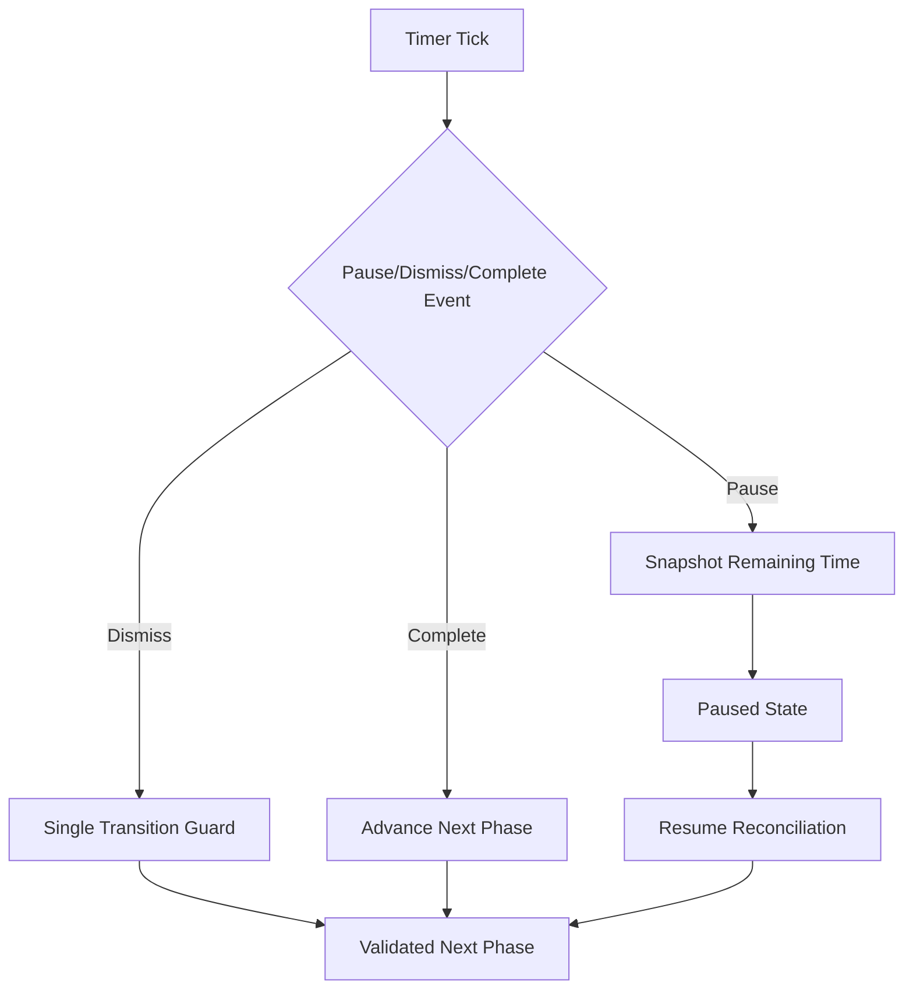

# Research: State and Timer Risks

## Focus

Identify highest-risk failure modes in timer-heavy workout flows and define mitigation expectations before implementation.

## Key Findings

1. Pause race conditions

- Risk: Timer tick and pause action may interleave, causing continued decrement while paused.
- Mitigation: Pause transition should atomically snapshot remaining time and gate further decrements.

2. Near-zero transition collisions

- Risk: User rest-dismiss action at or near timer completion can produce duplicate phase transitions.
- Mitigation: Introduce idempotent phase transition guards and completion tokens.

3. Lifecycle drift

- Risk: Background/foreground changes can cause inaccurate timer values.
- Mitigation: Reconcile using timestamps on resume and ensure paused state freezes progression.

4. Scoped restart leakage

- Risk: Restart-set/exercise actions may unintentionally mutate adjacent scope state.
- Mitigation: Define strict reset boundaries and add invariants for unaffected indices.

## Mermaid: Risk Flow

## Implications for Plan

- Prioritize timer correctness and transition safety before UX polish.
- Pair each risky transition with explicit unit + e2e coverage.
