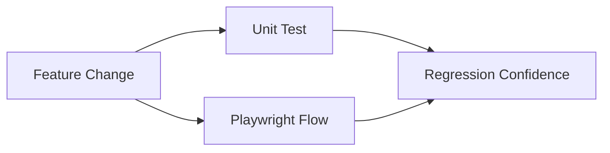

# Research: Testing Matrix

## Objective

Define minimum test coverage expectations for each planned feature area.

## Matrix

| Feature Area                   | Unit Tests    | Playwright E2E | Notes                             |
| ------------------------------ | ------------- | -------------- | --------------------------------- |
| Pause/resume across phases     | Required      | Required       | Validate freeze + exact resume    |
| Rest `+` control               | Required      | Required       | Include boundary/step behavior    |
| Cue dispatch/settings          | Required      | Required       | E2E can validate UI + stubs       |
| Explicit start                 | Required      | Required       | Enforce no-auto-start invariant   |
| Swipe dismiss rest             | Required      | Required       | Mobile gesture path               |
| Restart current exercise       | Required      | Required       | Scoped reset                      |
| Restart current set            | Required      | Required       | Scoped reset                      |
| Between-exercise timer display | Required      | Required       | Visibility assertion              |
| Between-set timer display      | Required      | Required       | Visibility assertion              |
| Timed-phase timer invariant    | Required      | Required       | Matrix-style phase coverage       |
| Exercise transition animation  | Optional unit | Required       | Prefer behavior over visual flake |
| README badges/screenshots      | Not required  | Optional smoke | Primarily doc validation          |

## Mermaid: Coverage Relationship

## Recommendation

Treat timer logic and phase transitions as high-risk paths requiring both deterministic unit checks and realistic mobile e2e validation.
